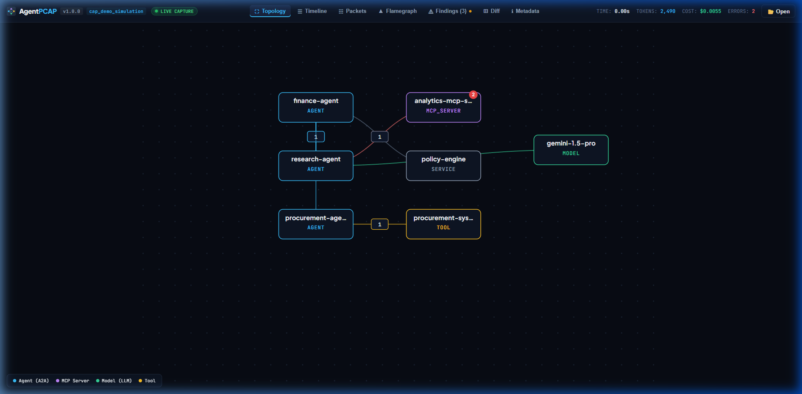
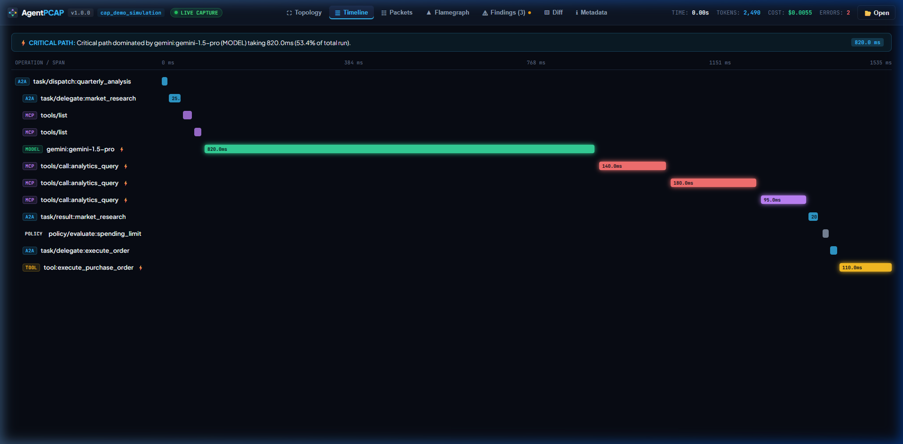
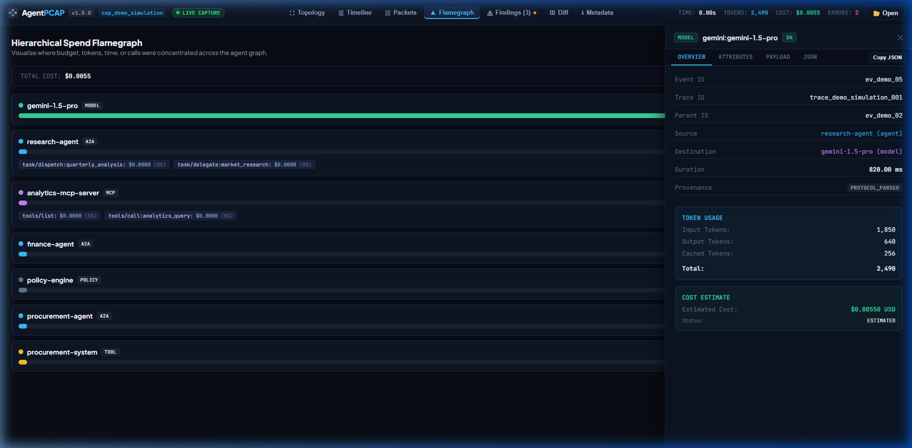

# AgentPCAP

## Wireshark for AI agents

> **Capture A2A, MCP, model and tool traffic in one local timeline.**  
> *No account. No API key. One Go binary.*

[](https://go.dev/)
[](LICENSE)
[](CHANGELOG.md)
[](docs/PRIVACY.md)

```bash
agentpcap run -- ./my-agent
```


---

## ⚡ What is AgentPCAP?

When an autonomous agent system fails, lags, or burns thousands of tokens, debugging typically involves digging through disparate logs across Model Context Protocol (MCP) servers, Agent-to-Agent (A2A) tasks, and raw LLM API calls.

**AgentPCAP** gives you instant, protocol-aware visibility into your entire agent network:

- **Zero-Config Launch**: Run `agentpcap run -- ./my-agent` or explore the simulated `agentpcap demo`.
- **Live Visual Debugging**: Animated agent topology, interactive packet lists, waterfall execution timelines, and critical path analysis.
- **Cost & Token Flamegraphs**: Hierarchical breakdown of where tokens, latency, and dollars were spent across agents and tools.
- **Zero-LLM Pathology Detection**: Deterministic offline analysis (`agentpcap explain`) that detects retry storms, recursive agent loops, and duplicate tool calls without calling external models.
- **Open Standard**: Captured in the portable, streamable `.apcap` (Agent Packet Capture) bundle format.

---

## 📸 Real UI in Action

### 1. Live Agent Topology

*Visual graph of agents, MCP servers, models, and external tools with animated request pulses and click-to-inspect edge telemetry.*



### 2. Waterfall Execution Timeline & Critical Path

*Inspect nested parent-child task delegations, identify concurrent spans, and pinpoint the longest wall-clock execution bottleneck.*



### 3. Hierarchical Cost & Token Flamegraphs

*Instantly identify which agent, model, or tool call dominated your token budget or cloud spend.*



---

## 🚀 Quickstart

### Option A: Try the Instant Multi-Agent Demo (No API Keys Required)

AgentPCAP includes an offline, deterministic simulation of a multi-agent workflow (finance agent, research agent, procurement agent, MCP analytics server, and simulated Gemini LLM):

```bash
# Build or download the binary, then run:
agentpcap demo
```

Your browser automatically opens to `http://127.0.0.1:9477`.

### Option B: Capture Your Own Agent

```bash
# Wrap your existing agent process
agentpcap run -- ./my-agent

# Or capture Python / Node / Go scripts
agentpcap run -- python main.py
```

AgentPCAP sets up local proxy listeners, injects standard `HTTP_PROXY` and `OTEL_EXPORTER_OTLP_ENDPOINT` environment variables, launches the child process safely, and streams events live to the viewer.

---

## 🔍 What AgentPCAP Sees

| Protocol Layer | What It Sees | Protocol Support Status |
| :--- | :--- | :--- |
| **A2A (Agent-to-Agent)** | Agent discovery, task requests, delegations, streaming responses, artifacts, cancellation | **SUPPORTED** (v1.0) |
| **MCP (Model Context Protocol)** | Server initialize, `tools/list`, `tools/call`, tool results, JSON-RPC errors | **SUPPORTED** (2024-11-05 & current) |
| **Model Providers** | Google Gemini / Vertex AI, OpenAI-compatible `/v1/...`, Anthropic Claude, generic LLM HTTP | **SUPPORTED** (Token usage & latency) |
| **Tool Calls** | Unified normalized tool invocations, SHA-256 argument fingerprints | **SUPPORTED** (Zero secret leaks) |
| **OpenTelemetry (OTel)** | Ingests OTLP/HTTP traces (`/v1/traces`), translates GenAI semantic conventions | **SUPPORTED** (OTLP JSON import/export) |
| **Generic HTTP** | Standard outgoing HTTP request methods, response status codes, timing | **SUPPORTED** (Metadata only) |

---

## 🧠 Deterministic Pathology Detection (`agentpcap explain`)

AgentPCAP analyzes captured traces offline **without requiring an LLM**. It runs deterministic graph heuristics across the event DAG:

```bash
agentpcap explain demo.apcap
```

```text
AGENTPCAP EXPLAIN REPORT
======================================================================
Capture ID:    demo-multi-agent-session
Duration:      1.10s
Events:        13
Critical Path: 950ms (86.4% of total time)
Bottleneck:    model-simulated-gemini (950ms)

PATHOLOGY FINDINGS (2 detected):
----------------------------------------------------------------------
[HIGH] RETRY_STORM (Confidence: 0.90)
  Operation "model.generateContent" executed 3 consecutive times with failures before succeeding.
  Evidence:
    - Attempt 1: Rate limit exceeded (429) (took 150ms)
    - Attempt 2: Service temporarily unavailable (503) (took 300ms)
    - Attempt 3: Succeeded (took 500ms)
  Action: Inspect rate limits and exponential backoff configuration on simulated-gemini.

[MEDIUM] DUPLICATE_DISCOVERY (Confidence: 0.85)
  Repeated MCP tools discovery requested 3 times within 1.1s.
  Evidence:
    - MCP tools/list executed redundantly 3 times on server "mcp-analytics"
  Action: Cache tool definitions on client startup to avoid repeated round-trips.
```

### Visual Pathology Inspector
The embedded viewer surfaces detected pathologies with severity badges, confidence ratings, and direct links to implicated events:


---

## ⚖️ Capture Diffing (`agentpcap diff`)

Compare two `.apcap` runs side-by-side to catch latency regressions, token bloat, or new retry storms:

```bash
agentpcap diff baseline.apcap candidate.apcap
```

```text
AGENT RUN DIFF
======================================================================
METRIC                   BASELINE          CANDIDATE              DIFF
----------------------------------------------------------------------
Total Duration              8.20s              4.10s            -50.0%
Total Events                   24                 15            -37.5%
Total Tokens               21,440             13,210            -38.4%
Total Cost                 $0.120             $0.074            -38.3%
Error Count                     3                  0           -100.0%

KEY CHANGES:
- Gemini retry storm resolved (3 retries -> 0 retries)
- Redundant MCP tools/list calls eliminated (4 calls -> 1 call)
```

The web viewer also includes an interactive visual diff mode:


---

## 🔒 Privacy & Security Defaults

AgentPCAP is built for sensitive enterprise and development environments:

1. **Local-First**: Captures remain on your machine. AgentPCAP includes **zero telemetry** and requires no account or cloud connection.
2. **Metadata-Only Default**: By default, AgentPCAP records only timing, token counts, protocols, models, tools, and error status codes. Raw prompts, LLM completion texts, and raw tool arguments are **never** stored on disk unless explicitly requested via `--capture-content`.
3. **Automated Secret Redaction**: Built-in scrubbing engine strips Google AI keys (`AIza*`), OpenAI keys (`sk-*`), Anthropic keys (`sk-ant-*`), GitHub tokens, JWTs, and `Authorization: Bearer` headers.
4. **Strict Loopback Binding**: Defaults to `127.0.0.1`. Binding to external interfaces requires an explicit `--listen` flag.
5. **Safe Process Execution**: `agentpcap run` invokes child commands via native `os/exec` slices—never via shell string interpolation.
6. **Hardened File Parser**: The `.apcap` archive reader enforces Zip-slip traversal prevention and strict 128 MB/256 MB decompression bomb limits.

See [SECURITY.md](docs/SECURITY.md) and [THREAT_MODEL.md](docs/THREAT_MODEL.md) for detailed invariants.

---

## 🏗️ Architecture

AgentPCAP runs as a single compiled Go binary embedding a high-performance React web viewer:

```text
               Target Agent Process (Python, Node, Go, Binary)
                                    │
                        ┌───────────┴───────────┐
                        │   Capture Subsystem   │
                        │ (Proxy, OTLP, Runner) │
                        └───────────┬───────────┘
                                    │
                         Protocol Normalization
                        (A2A, MCP, Models, Tools)
                                    │
                        ┌───────────┴───────────┐
                        │     Session Engine    │
                        │ (In-Memory / Ringbuf) │
                        └───────────┬───────────┘
                                    │
                 ┌──────────────────┼──────────────────┐
                 ▼                                     ▼
        ┌─────────────────┐                   ┌─────────────────┐
        │  .apcap Stream  │                   │ Embedded Server │
        │ (ZIP Container) │                   │  (SSE + REST)   │
        └────────┬────────┘                   └────────┬────────┘
                 │                                     │
      ┌──────────┴──────────┐                          ▼
      ▼                     ▼                 ┌─────────────────┐
CLI Tools               CI Check              │ React Viewer UI │
(explain, diff, top)  (Quality Gates)         │(Topology, Flame)│
                                              └─────────────────┘
```

---

## 📦 The Open `.apcap` Format

AgentPCAP captures are stored in the standardized `.apcap` container—a portable, streaming ZIP bundle:

```text
my-run.apcap
├── manifest.json       # Session metadata, integrity hashes, protocol summary
├── events.jsonl        # Normalized event records (one JSON object per line)
├── metadata.json       # Host and environment context
└── attachments/        # Optional sanitized payloads and export artifacts
```

Formal JSON Schema: [`spec/apcap.schema.json`](spec/apcap.schema.json)  
Specification Guide: [`spec/README.md`](spec/README.md)

---

## 🛠️ CLI Command Reference

```text
agentpcap <command> [flags]

COMMANDS:
  run -- <cmd>              Launch child process under proxy/OTel capture
  demo                      Launch simulated multi-agent offline workflow
  open <file.apcap>         Serve and open capture file in local web viewer
  proxy                     Run explicit HTTP/CONNECT forward capture proxy
  otlp                      Run OTLP/HTTP trace receiver (/v1/traces)
  explain <file.apcap>      Run deterministic offline diagnostics and critical path analysis
  diff <file1> <file2>      Compare two captures (terminal table or --json)
  check <file.apcap>        Evaluate capture against CI quality gate rules (.agentpcap.yml)
  summary <file.apcap>      Display formatted terminal metrics summary
  top <file.apcap>          Show top consumers by latency, tokens, cost, or errors
  report <file.apcap>       Export standalone self-contained offline HTML report
  validate <file.apcap>     Validate capture integrity against schema and SHA-256 hashes
  redact <in> -o <out>      Scrub secrets and tokens from existing capture
  inspect-redaction <file>  Scan capture for potential unredacted API keys or secrets
  export otlp <file.apcap>  Export capture events to standard OpenTelemetry JSON
  doctor                    Verify local environment, ports, and parser status
  version                   Print version and build metadata
```

---

## 💻 Building from Source

Prerequisites: **Go 1.22+** and **Node.js 20+** (with `pnpm`):

```bash
# 1. Clone repository
git clone https://github.com/agentpcap/agentpcap.git
cd agentpcap

# 2. Build web assets & compile static Go binary
make web
make build

# 3. Verify tests and run demo
make test
./agentpcap demo
```

---

## 📄 License

AgentPCAP is open-source software licensed under the [Apache License, Version 2.0](LICENSE).
The `.apcap` format specification is dedicated to the open-source community for royalty-free implementation.
